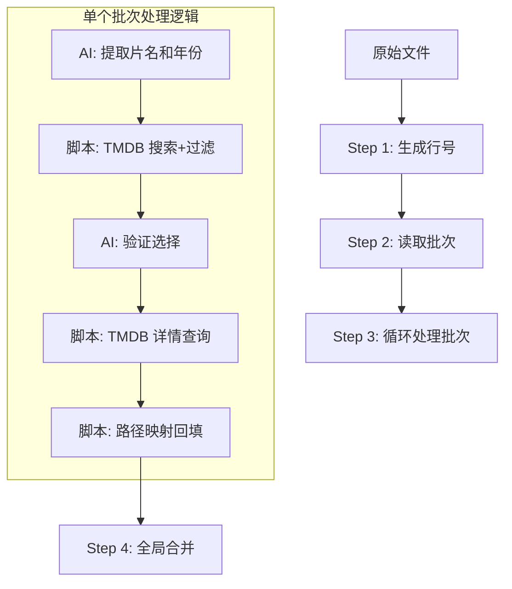

# 🎬 TMDB 电影信息补全工作流

本工作流通过 **Node.js 脚本** 提供核心能力，通过**分批次循环处理**来解决大规模数据的上下文过载问题。每个批次独立完成从"路径提取"到"路径映射"的闭环。
工作目录：~/.openclaw/workspace/tmdb_scrap，所有临时/最终的文件或文件夹都放到这个目录下，以免污染其它目录。

## 🛠 工作流概览



---

## 📝 详细操作流程

### Step 1: 生成行号索引
为原始文件生成全局行号，作为全流程的唯一关联键（Key）。
- **命令**: `node gen_file_with_num.js list.txt indexed.txt`

### Step 2: 读取批次
从带行号的文件读取一个批次，每个文件建议 30 行，以控制单次 AI 处理的 Token 长度。
- **命令**: `node get_one_bach_lines.js <输入> <批次编号> <行数>`
- **输入**: 带行号的文件, 批次编号, 每批次行数
- **输出**: 打印到控制台，本批次的所有行，格式：行号#路径
- **注意**: 每个批次循环开始时读取一次，不要一次性预读取多批，也不要把读取内容存入临时文件。

### Step 3: 批次执行逻辑（通过Subagent执行）
针对每个批次，启一个Subagent，注意只启一个Subagent，不要多个并发，否则会触发API 429错误，按顺序执行以下任务：

1. **AI 提取**: 从原始路径中智能提取**纯净片名**和**年份**（处理路径乱码、去除字幕组标签等）。
   * 格式化为：`行号#全路径名#纯净片名#年份`

2. **脚本搜索**: 调用 `node tmdb_search.js` 获取候选列表。
   * **逻辑**: 脚本内部进行年份容差过滤 (±1 年)。
   * **输入**: `temp/batch-XX-clean.txt`
   * **输出**: `temp/batch-XX-search.txt` (含候选结果集)
   * **注意**: 搜索结果为空时直接记录至错误文件，不进入下一步。

3. **⚠️ AI 验证选择（必做）**: 从搜索结果候选中选出最匹配的 `TMDB_ID`。
   * **必须执行，不可跳过**
   * 输入: 搜索结果文件（包含多个候选的数组）
   * 输出: `temp/batch-XX-selected.txt`，只包含选中的1个ID
   * **输出格式要求**: 单个object（不是数组），格式为:
     ```
     挑选成功：行号#路径#片名#{"id":123,"title":"中文名","year":"2024","media_type":"movie","vote_average":8.5}
     挑选失败：行号#路径#片名#{}
     ```
   * **关键**: `#{` 后面是单个JSON object，不带方括号 `[]`
   * 如果输出格式错误（仍然是数组），详情脚本会报错并拒绝处理

   * **选择规则说明**: 
   * 根据路径中的片名相关性选择，如果没有相关的结果则不选（即选中结果为空{}）

4. **脚本详情**: 调用 `node tmdb_details.js` 获取国家、评分、海报等详细元数据。

5. **脚本映射**: 调用 `node map_path.js` 将 API 结果与原始路径关联，生成最终行数据。
   * **输入**: `不带行号的原始文件，例如list.txt`
   * **成功输出**: `results/success-XX.txt`
   * **错误输出**: `results/error-XX.txt`

**文件命名与格式规范**:
- 统一使用 `#` 作为分隔符，避免路径中常见的 `|` 或 `,` 导致解析错误。
- **最终格式**: `路径#中文名#TMDB_ID#评分#海报#年份#国家#类型`

### Step 4: 合并最终输出
当所有批次处理完成后，汇总结果。
- **命令**: `node merge.js results/success- results/error- final_success.txt final_error.txt`

---

## 📂 脚本功能矩阵

| 脚本名称 | 核心功能 | 执行频率 |
| :--- | :--- | :--- |
| `gen_file_with_num.js` | 准备全局索引 | 全局仅一次 |
| `get_one_bach_lines.js`| 任务切片 | 每个批次一次 |
| `tmdb_search.js` | 搜索 + 年份容差过滤 | 每个批次一次 |
| `tmdb_details.js` | 获取详情 (movie/tv) | 每个批次一次 |
| `map_path.js` | 将结果映射回原始路径 | 每个批次一次 |
| `merge.js` | 汇总结果 | 全局仅一次 |

---

## 🚀 执行示例

```bash
# 1. 初始化环境
mkdir -p temp results
node gen_file_with_num.js list.txt temp/indexed.txt

# 2. 循环处理批次 (以批次01为例)
node get_one_bach_lines.js indexed.txt 1 50

# [AI 步骤]: 从get_one_bach_lines.js 控制台输出提取片名/年份 -> 存入 batch-01-clean.txt
##### **重要提醒：纯AI提取，不得使用脚本，也不要生成脚本提取**
##### * 1、影片名：从路径中提取，如果路径中同时存在多种语言片名，中文优先*
##### * 2、年份：从路径中提取，如果路径中没有年份，保持为空*

# [脚本步骤]: node tmdb_search.js temp/batch-01-clean.txt temp/batch-01-search.txt 1

# [AI 步骤]: 从 search 结果中选 ID -> 存入 temp/batch-01-selected.txt
##### **重要提醒：纯AI选择，不得使用脚本，也不要生成脚本选择**

# [脚本步骤]: node tmdb_details.js temp/batch-01-selected.txt temp/batch-01-details.txt

# [脚本步骤]: node map_path.js list.txt temp/batch-01-details.txt results/success-01.txt results/error-01.txt

# 3. 最终汇总
node merge.js results/success- results/error- final_all_success.txt final_all_error.txt
```

---

## ⚠️ 重要提醒

- **AI验证选择步骤不可跳过**: 每批次必须执行AI验证步骤，从搜索候选结果中选择最匹配的TMDB ID，然后才能进入详情查询步骤。
- **AI验证选择输出格式**: 必须输出单个object格式，不是数组。例如：
  - 错误: `#{"id":123,"title":"名"},{"id":456,"title":"名2"}]` (这是数组)
  - 正确: `#{"id":123,"title":"名","year":"2024","media_type":"movie","vote_average":8.5}` (这是单个object)
- 搜索结果为空是正常的（TMDB上没有对应影片），直接输出到错误结果，无需AI再去匹配

💡 **核心优势说明**:

1. **上下文隔离**: 通过 `batch-XX.txt` 将长文本拆分，确保 AI 在提取和选择 ID 时不会因为 Token 过长而导致幻觉。

2. **脚本容错**: 年份过滤和空结果处理由脚本控制，AI 仅负责逻辑判断，显著提升准确率。

3. **断点续传**: 若某个批次失败，只需重新处理该批次的 `success-XX.txt` 即可。
