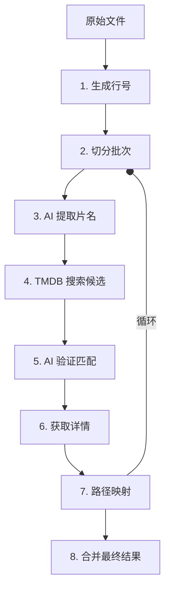

# 🎬 TMDB 电影信息补全工作流

本工作流通过 **Node.js 脚本自动化** 与 **AI 智能识别** 相结合，将含有路径信息的原始电影记录补全为包含海报、评分、类型等元数据的标准化数据。

## 🛠 工作流概览



---

## 📝 详细操作流程

### 第一阶段：预处理

#### 步骤 1：生成带行号的完整文件
为原始数据建立唯一索引，确保后续处理可以精准回溯路径。
- **命令**: `node gen_file_with_num.js <输入文件> <输出文件>`
- **示例**: `node gen_file_with_num.js /tmp/incomplete_lines/incomplete.txt /tmp/incomplete_lines/incomplete_with_num.txt`

#### 步骤 2：获取批次文件
由于 API 限制和 AI 上下文长度，建议分批处理（如 100 行/批）。
- **命令**: `node get_one_bach_lines.js <输入文件> <输出文件> <批次编号> <每批次行数>`
- **输出**: `batch1_names.txt`

#### 步骤 3：AI 提取片名
**操作**: 将批次文件内容发送给 AI。
**说明**: 电影路径通常包含组名、年份、乱码等，脚本难以精准提取，利用 AI 从路径中智能提取出“纯净片名”和“年份”。

---

### 第二阶段：检索与筛选

#### 步骤 4：TMDB 搜索（仅获取候选）
通过搜索接口返回所有可能的匹配项。
- **命令**: `node tmdb_search.js <输入文件> <输出文件>`
- **输入格式**: `行号|电影名`
- **API 逻辑**: 调用 `search/multi` (支持电影和剧集)，不查询具体详情。

#### 步骤 5：AI 验证选择
**操作**: 将 TMDB 返回的候选列表提供给 AI 进行二次确认。
**强制规则**: 
1. 年份容差必须在 $\pm 1$ 年内。
2. 片名相似度最高优先。
- **输出**: `temp_selected.txt` (格式：`行号|电影名|{选中的TMDB ID}`)

---

### 第三阶段：详情获取与映射

#### 步骤 6：TMDB 详情查询
根据 AI 选定的 ID 获取完整的元数据。
- **命令**: `node tmdb_details.js <输入文件> <输出文件>`
- **获取字段**: 国家、类型、评分、海报路径 (`poster_path`)、IMDB ID 等。

#### 步骤 7：路径映射
将补全的信息映射回最初的原始路径。
- **命令**: `node map_path.js <原始文件> <成功文件> <错误文件> <成功输出> <错误输出>`
- **成功格式**: `路径#中文名#TMDB_ID#评分#海报#年份#国家#类型`

---

### 第四阶段：收尾

#### 步骤 8：循环执行
重复步骤 2~7，直到处理完所有批次。

#### 步骤 9：合并输出文件
将所有批次的成功和错误结果分别合并为最终文件。
- **命令**: `node merge.js <成功文件前缀> <错误文件前缀> <成功输出> <错误输出>`

---

## 📂 脚本功能矩阵

| 脚本名称 | 核心功能 | 备注 |
| :--- | :--- | :--- |
| `gen_file_with_num.js` | 建立行号索引 | 整个工作流的唯一标识基础 |
| `tmdb_search.js` | 模糊搜索候选人 | 包含 id, title, year, vote_average |
| `tmdb_details.js` | 精准抓取详情 | 包含 countries, genres, poster_path |
| `map_path.js` | 数据关联回填 | 将详情映射回原始路径 |
| `merge.js` | 分片数据汇总 | 合并各批次的 txt 文件 |

---

## 🚀 快速执行示例

```bash
# 1. 准备阶段
node gen_file_with_num.js /tmp/data/incomplete.txt /tmp/data/indexed.txt

# 2. 批次处理 (以第1批100条为例)
node get_one_bach_lines.js /tmp/data/indexed.txt /tmp/data/batch1.txt 1 100

# 3. 搜索与查询 (假设 AI 已完成中间步骤)
node tmdb_search.js /tmp/data/batch1_ai_extracted.txt /tmp/data/batch1_search.txt
node tmdb_details.js /tmp/data/batch1_ai_selected.txt /tmp/data/batch1_details.txt

# 4. 映射结果
node map_path.js /tmp/data/incomplete.txt /tmp/data/batch1_details.txt /tmp/data/batch1_err.txt /tmp/data/batch1_success.txt /tmp/data/batch1_final_err.txt

# 5. 合并
node merge.js batch_success_ batch_error_ all_success.txt all_error.txt
```