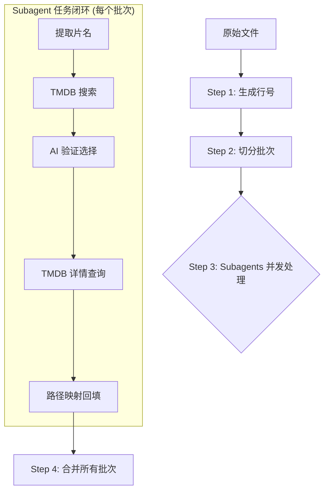

# 🎬 TMDB 电影信息补全工作流 (Subagents 全流程版)

本工作流通过 **Node.js 脚本** 提供核心能力，并将复杂的逻辑串联交给 **Subagents (子智能体)** 并发执行。每个 Subagent 独立负责一个批次的完整生命周期。

## 🛠 工作流概览



---

## 📝 详细操作流程

### Step 1: 生成行号索引
首先为原始不完整文件生成全局行号，作为全流程的唯一关联键。
- **命令**: `node gen_file_with_num.js /tmp/incomplete.txt /tmp/incomplete_with_num.txt`

### Step 2: 切分批次
将带行号的文件切分为多个批次文件（如 `batch-01.txt`, `batch-02.txt` 等），每个文件建议 50 行。
- **命令**: `node get_one_bach_lines.js <输入> <输出> <批次编号> <行数>`

### Step 3: 并发处理 (Subagent Instructions)
启动多个 Subagent 同时处理不同的批次文件。**告诉每个 Subagent 以下指令：**

1. **输入文件**: 负责处理特定的 `batch-XX.txt`（格式：行号|原始路径）。
2. **流程要求**:
    - **提取 (AI)**: 从原始路径中智能提取纯净片名和年份（处理路径乱码）。
    - **搜索 (脚本)**: 调用 `node tmdb_search.js` 获取候选列表。
    - **验证 (AI)**: 从候选中选出 ID。强制要求年份容差 $\pm 1$。
    - **详情 (脚本)**: 调用 `node tmdb_details.js` 获取国家、评分、海报等。
    - **映射 (脚本)**: 调用 `node map_path.js` 将详情与原始路径关联。
3. **文件命名规范**:
    - 中间结果: `temp/batch-XX-search.txt`, `temp/batch-XX-details.txt`
    - 成功输出: `results/success-XX.txt`
    - 错误输出: `results/error-XX.txt`
4. **最终格式**: `路径#中文名#TMDB_ID#评分#海报#年份#国家#类型`

### Step 4: 合并最终输出
当所有 Subagents 完成任务并关闭后，执行最后合并。
- **命令**: `node merge.js results/success- results/error- final_success.txt final_error.txt`

---

## 📂 脚本功能矩阵

| 脚本名称 | 核心功能 | Subagent 调用频率 |
| :--- | :--- | :--- |
| `gen_file_with_num.js` | 准备全局索引 | 仅一次 (Step 1) |
| `tmdb_search.js` | 访问 `search/multi` 接口 | 每个 Subagent 调用 |
| `tmdb_details.js` | 访问 `movie/tv` 详情接口 | 每个 Subagent 调用 |
| `map_path.js` | 将 API 结果映射回路径 | 每个 Subagent 调用 (Step 3 结尾) |
| `merge.js` | 汇总所有批次结果 | 仅一次 (Step 4) |

---

## 🚀 快速执行示例

```bash
# 1. 准备工作
node gen_file_with_num.js ./list.txt /tmp/indexed.txt
node get_one_bach_lines.js /tmp/indexed.txt /tmp/batch-01.txt 1 50
node get_one_bach_lines.js /tmp/indexed.txt /tmp/batch-02.txt 2 50

# 2. Subagent 并发执行 (逻辑示意)
# [Subagent 1]: 
#    node tmdb_search.js batch-01.txt ... 
#    -> node tmdb_details.js ... 
#    -> node map_path.js list.txt batch-01-details.txt err1.txt results/success-01.txt ...

# [Subagent 2]: 
#    node tmdb_search.js batch-02.txt ... 
#    -> node tmdb_details.js ... 
#    -> node map_path.js list.txt batch-02-details.txt err2.txt results/success-02.txt ...

# 3. 最终合并
node merge.js results/success- results/error- final_all_success.txt final_all_error.txt
```

---
💡 **注意**: 
- 请确保 `results/` 目录在开始前已创建。
- Subagent 在执行 `map_path.js` 时需要访问全局原始文件以读取完整路径。
- Subagent并发是假并发，只允许1个实例运行。采用Subagent的目的主要还是减少主Agent的上下文冲击。